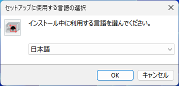
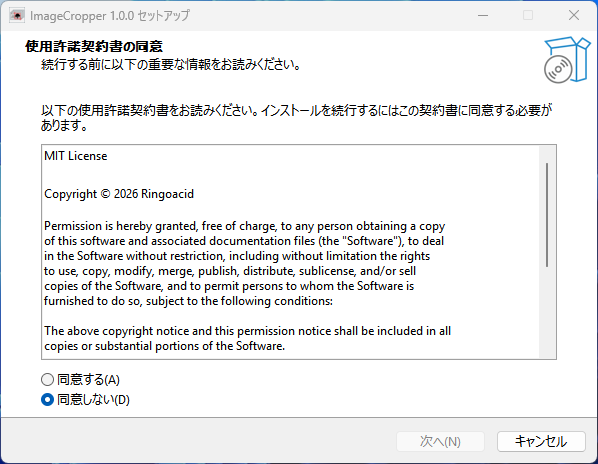
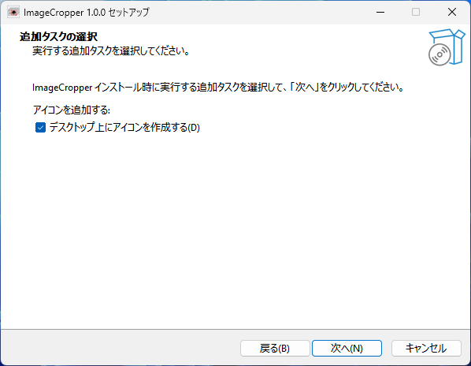
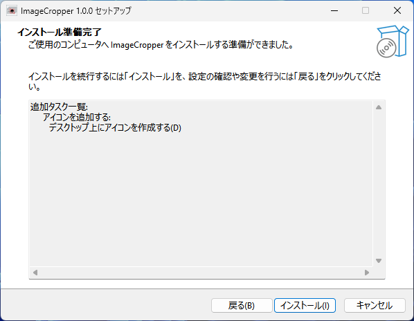
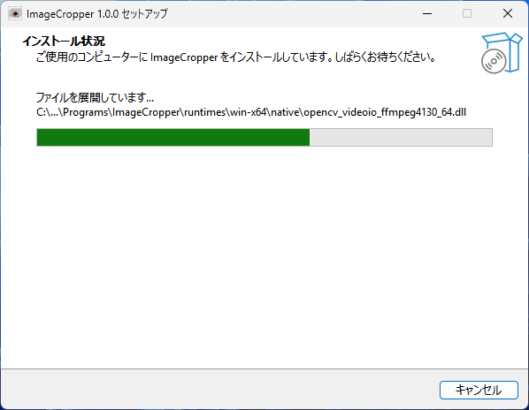
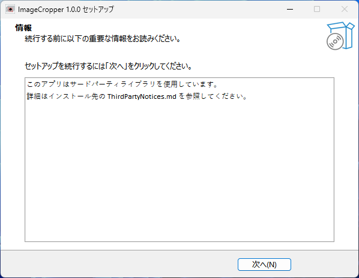
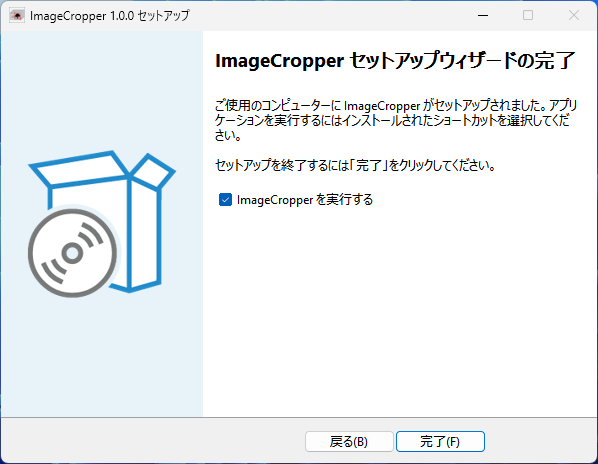

# インストール方法
GitHubのリリースページからインストーラーをダウンロードして、実行してください。

## 1. 言語の選択
インストール中に使用する言語を選択します。このドキュメントでは日本語を選択します。

## 2. 使用許諾契約書の同意
このアプリ（ImageCropper）は、MITライセンスのもとで配布されており、使用許諾契約書に同意する必要があります。内容を確認して、同意できる場合は「同意する」を選択してください。

## 3. デスクトップアイコンの作成
インストール後にデスクトップアイコンを作成するかどうかを選択します。必要に応じてチェックを入れてください。

## 4. インストールの準備完了
内容を確認して、インストールの準備ができたら「インストール」をクリックしてください。

## 5. インストール中の様子
圧縮されたファイルを展開して、必要なファイルをインストール先にコピーしています。

## 6. ThirdPartyNoticeについて
このアプリではNuGetパッケージを使用しています。帰属表示や、ライセンス全文などの情報は、インストール先の ThirdPartyNotices.md を参照してください。

## 7. セットアップ完了
インストールが完了しました。「完了」をクリックしてセットアップウィザードを終了してください。

