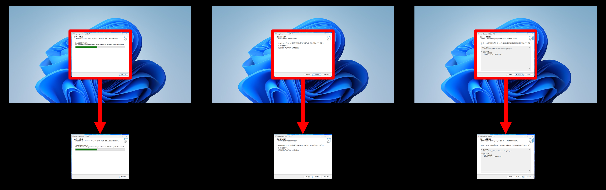

# ImageCropper
複数の画像から同じ範囲を切り取るためのアプリケーション。

## インストール
GitHubのリリースページから最新のバージョンをダウンロードしてください。
インストール方法について、詳しくは[HowToInstall.md](HowToInstall.md)を参照してください。

## 使用方法

### 画像ファイルの読み込み
「ファイル」メニューまたはドラッグ＆ドロップで画像を読み込みます。

- **「画像を開く」**: 1枚もしくは複数枚の画像を選択して読み込みます。
- **「フォルダを開く」**: 選択したフォルダの直下にある画像を読み込みます。
- **「フォルダを再帰的に開く」**: サブフォルダも含めてすべての画像を読み込みます。
- **ドラッグ＆ドロップ**: 画像ファイルやフォルダを直接アプリにドロップして読み込みます。

#### 対応入力形式
`.jpg` / `.jpeg` / `.jpe` / `.png` / `.bmp` / `.dib` / `.gif` / `.tiff` / `.tif` / `.webp` / `.jp2` / `.pbm` / `.pgm` / `.ppm` / `.sr` / `.ras` / `.exr` / `.hdr`

### 切り抜き範囲の指定
読み込まれた画像リストから画像を選択すると、右側にプレビューが表示されます。

- **切り抜き範囲の作成**: プレビュー上でマウスをドラッグ
- **範囲の移動**: 範囲内をドラッグ
- **サイズ変更**: 四隅や辺の中央にあるハンドルをドラッグ
- **範囲の削除**: 範囲を選択してDeleteキー
- **手動設定**: 切り抜き範囲を右クリックすると、ピクセル単位または割合（%）で数値を入力して詳細な指定ができます。

#### プレビューの操作
| 操作 | 方法 |
|------|------|
| スクロール（垂直） | マウスホイール |
| スクロール（水平） | Shift + マウスホイール |
| 拡大・縮小 | Ctrl + マウスホイール |

#### 画像リストの操作
| 操作 | 方法 |
|------|------|
| 範囲選択 | Shift + クリック |
| 個別選択・解除 | Ctrl + クリック |
| コンテキストメニュー | 右クリック |
| リストから削除 | Deleteキー |

### 出力設定と切り抜き実行
切り抜き範囲を指定したら、出力設定を確認して「切り取り実行」ボタンをクリックします。

| 設定項目 | 説明 |
|----------|------|
| **出力先フォルダ** | 切り取った画像の保存先 |
| **出力拡張子** | 保存時のフォーマット（`.png`, `.jpg`, `.bmp`, `.tiff` など） |
| **マルチスレッド処理** | 有効にすると並列実行で高速化（負荷が高くなります） |
| **切り取り範囲が画像外でも処理** | 範囲が画像の外側にはみ出している場合でも処理を続行するか |

### 設定
「設定」メニューから設定ウィンドウを開いて、出力設定やUI設定をカスタマイズできます。

- **出力タブ**: 出力拡張子、出力先フォルダ、マルチスレッド処理などの設定
- **UIタブ**: ドラッグ中の範囲表示形式（ピクセル/割合、XYWH/X1Y1X2Y2）の設定
- **エクスポート/インポートタブ**: 設定をJSONファイルとして保存・読み込み

## ライセンス
MIT License